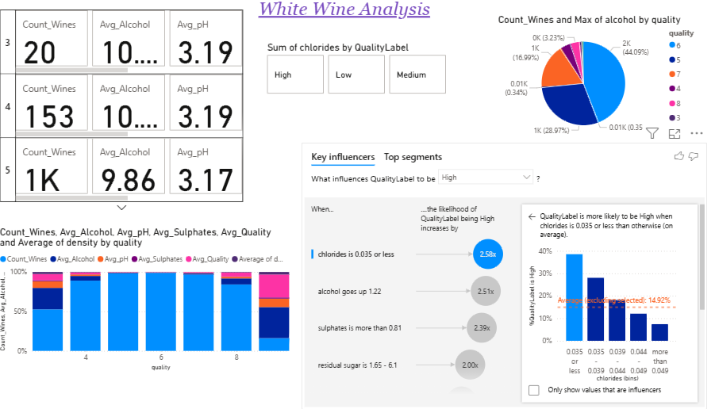

**Project ID:** DV-22886  
**Author:** Deepa Vutharkar 

# White_Wine_Analytics_Project

   

---

## 📌 Project Overview
This project analyzes the White Wine Quality dataset to understand the factors affecting wine quality.  
The analysis includes exploratory data analysis (EDA), data cleaning, visualization, and optional machine learning steps to predict wine quality.

---

## 📂 Dataset Information
- **Dataset:** winequality-white.csv  
- **Source:** UCI Machine Learning Repository  
- **Records:** 4,898 white wine samples  
- **Features:** 11 physicochemical attributes + 1 quality score (3–9)  

---

## 🛠️ Tools & Technologies
- Python 3.x  
- Pandas, NumPy  
- Matplotlib, Seaborn  
- Scikit-learn (optional for ML)  
- Power BI (optional interactive visualizations)  

## 🔍 Analysis Workflow
1. Data loading and inspection  
2. Descriptive statistics and feature distributions  
3. Missing values & duplicates check  
4. Outlier detection and treatment  
5. Correlation analysis  
6. Target variable (quality) analysis  

## 🧠 Analytical Interpretation
- Most wines are rated between **5–7**.  
- **Higher alcohol content** is associated with higher quality ratings.  
- **Volatile acidity** negatively impacts wine quality.  
- **Residual sugar** has little correlation with quality.  
- Positive correlations exist among density, fixed acidity, and citric acid.  
- Outliers are present in some features, but most data is consistent.  
- The dataset contains **no missing values**, making it ready for modeling.

---

## 🎯 Skills Demonstrated
- Exploratory Data Analysis (EDA)  
- Data Cleaning & Preprocessing  
- Outlier Detection (IQR, Winsorization)  
- Data Visualization  
- Statistical Correlation Analysis  
- Python for Data Analysis  

---
Images

  
 **Insights from Analysis**

- Wines with higher alcohol content generally have better quality.

- Volatile acidity negatively impacts wine quality.

- Residual sugar shows little correlation with quality.

- Positive correlations observed among density, fixed acidity, and citric acid.

- Outliers exist in some features (like alcohol and sulphates), but most data is consistent.

- There are no missing values in the dataset, making it clean for modeling.

  
 **Project Structure**
  
  White_Wine_Analytics_Project/
├── Whitewine_EDA.ipynb           
├── README.md                     
├── winequality-white.csv       
├── White_wine.pbix            
├── winechart.png                
└── images/                       
    ├── quality_distribution.png
    ├── correlation_heatmap.png
    ├── alcohol_vs_quality.png
    ├── outliers_residual_sugar.png
    └── powerbi_dashboard.png

